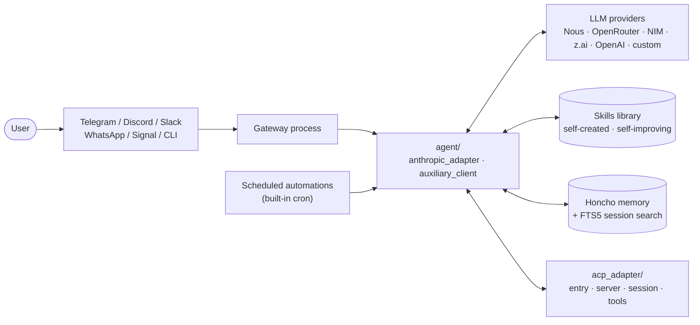

# Hermes Agent

> Personal fork of [NousResearch/hermes-agent](https://github.com/NousResearch/hermes-agent) — the self-improving AI agent with a built-in learning loop.

**Author (fork maintainer)**: [@Lee-unhn](https://github.com/Lee-unhn) · a2264563@gmail.com

<p align="center">
  
</p>

<p align="center">
  <a href="https://hermes-agent.nousresearch.com/docs/"></a>
  <a href="https://discord.gg/NousResearch"></a>
  <a href="LICENSE"></a>
  <a href="README.zh-CN.md"></a>
</p>

## Overview

Hermes Agent is the self-improving AI agent built by [Nous Research](https://nousresearch.com). It is the only agent with a built-in learning loop — it creates skills from experience, improves them during use, nudges itself to persist knowledge, searches its own past conversations, and builds a deepening model of who you are across sessions. It runs on a $5 VPS, a GPU cluster, or serverless infrastructure that costs nearly nothing when idle. It is not tied to your laptop — talk to it from Telegram, Discord, Slack, WhatsApp, Signal, or the CLI while it works on a cloud VM.

This repository is a personal fork tracking upstream. For canonical documentation, releases, and contribution flow, please refer to [NousResearch/hermes-agent](https://github.com/NousResearch/hermes-agent).

## Architecture



## Tech Stack

- Python (Dockerised; CI via GitHub Actions)
- Pluggable LLM providers: Nous Portal, OpenRouter (200+ models), NVIDIA NIM (Nemotron), Xiaomi MiMo, z.ai/GLM, Kimi/Moonshot, MiniMax, Hugging Face, OpenAI, or any custom endpoint — switch via `hermes model`, no code changes
- ACP (Agent Communication Protocol) adapter — `acp_adapter/`
- Multi-platform gateway: Telegram, Discord, Slack, WhatsApp, Signal, CLI
- Honcho dialectic user modeling for cross-session memory; FTS5 search over past conversations
- Compatible with the [agentskills.io](https://agentskills.io) open standard
- Built-in cron scheduler for unattended automations
- Nix flake + Dockerfile for reproducible deployment

## Key Files

- `README.md` / `README.zh-CN.md` — upstream documentation (mirrored)
- `AGENTS.md` — agent design notes from upstream
- `Dockerfile` — container image used in production / VPS deployment
- `agent/` — core agent loop (`anthropic_adapter.py`, `auxiliary_client.py`, `account_usage.py`)
- `acp_adapter/` — ACP server, entry, session, permissions and tool plumbing
- `acp_registry/agent.json` — agent manifest for the ACP registry
- `.github/workflows/` — tests, docker publish, supply-chain audit, docs deploy
- `RELEASE_v0.*.md` — per-version release notes (kept in sync with upstream)

## Usage

This fork follows upstream installation. For the canonical, always-current instructions see the official docs at [hermes-agent.nousresearch.com/docs](https://hermes-agent.nousresearch.com/docs/) and the upstream [README](https://github.com/NousResearch/hermes-agent#readme).

Quick start (Docker):

```bash
# 1. clone
git clone https://github.com/Lee-unhn/hermes-agent.git
cd hermes-agent

# 2. copy env template and fill in keys for your chosen provider(s)
cp .env.example .env

# 3. run via Docker
docker build -t hermes-agent .
docker run --rm -it --env-file .env hermes-agent
```

Switch model providers at runtime with `hermes model`.

## License

MIT — see [`LICENSE`](LICENSE). Upstream copyright belongs to Nous Research.
